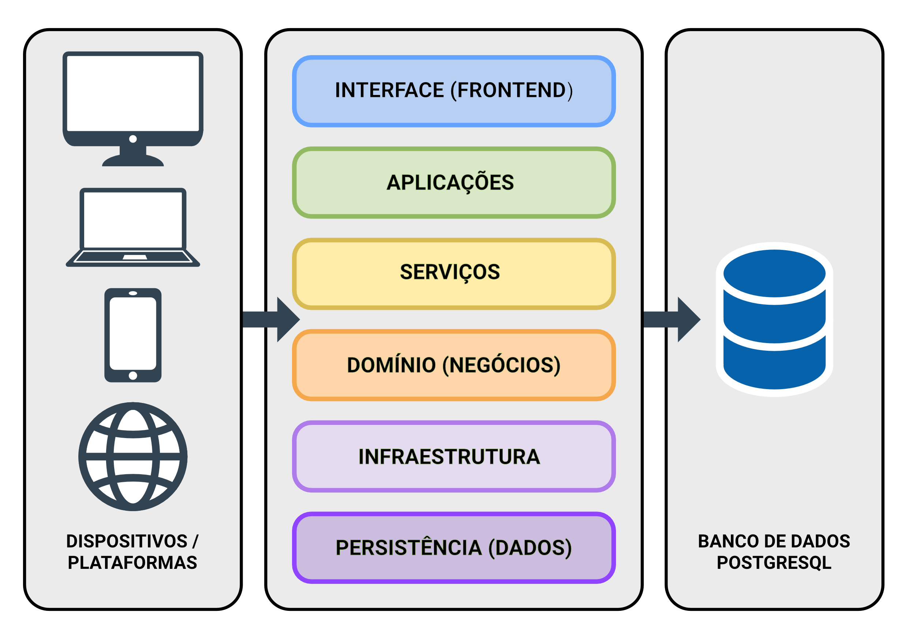
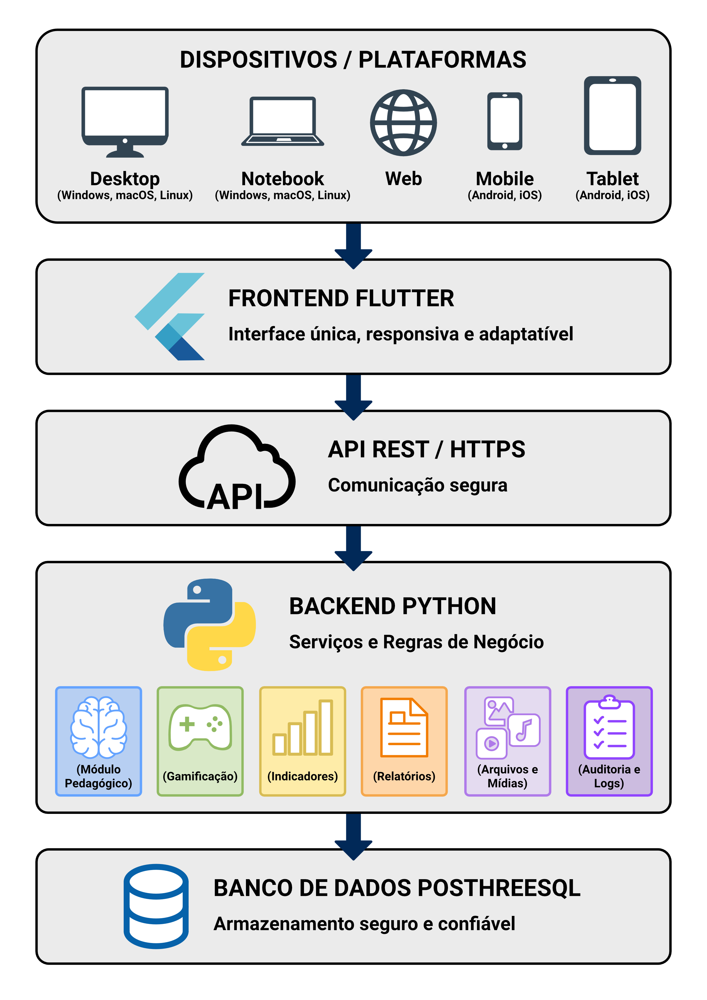
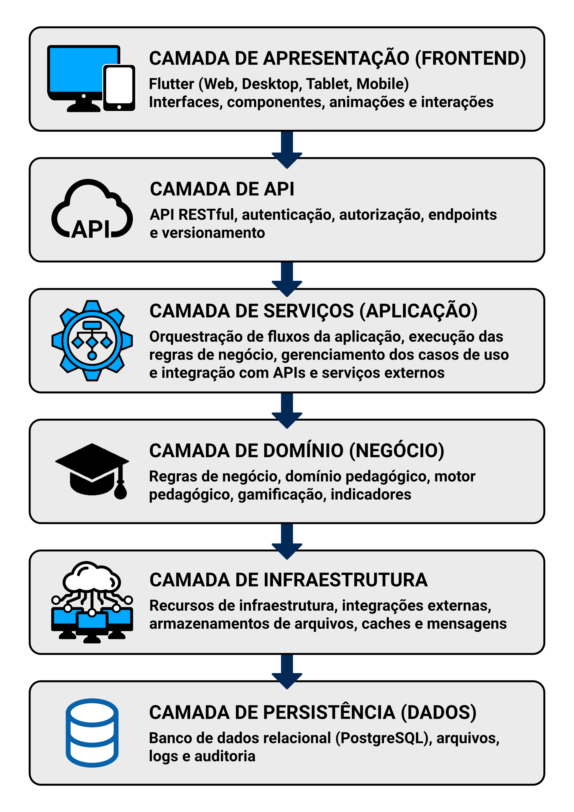
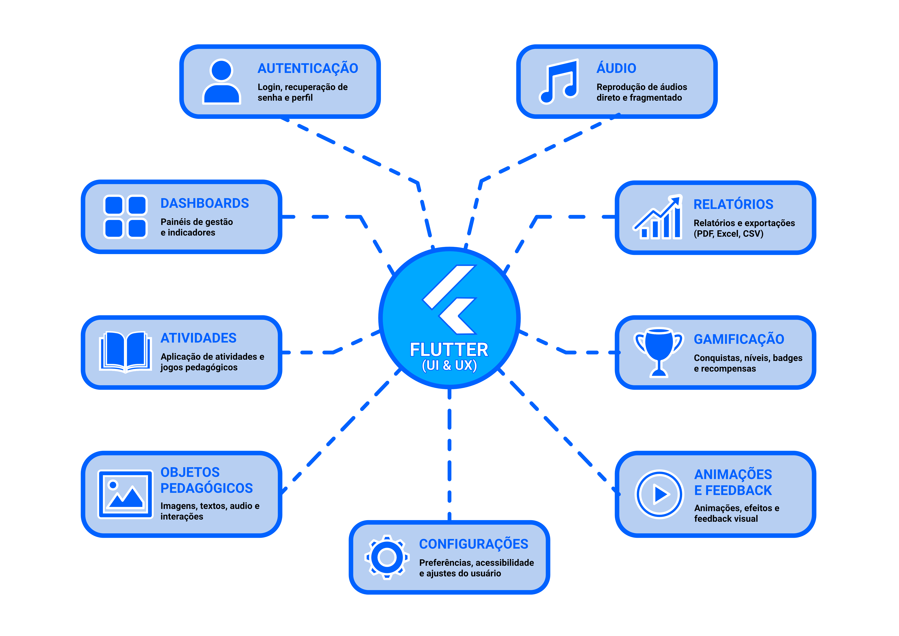
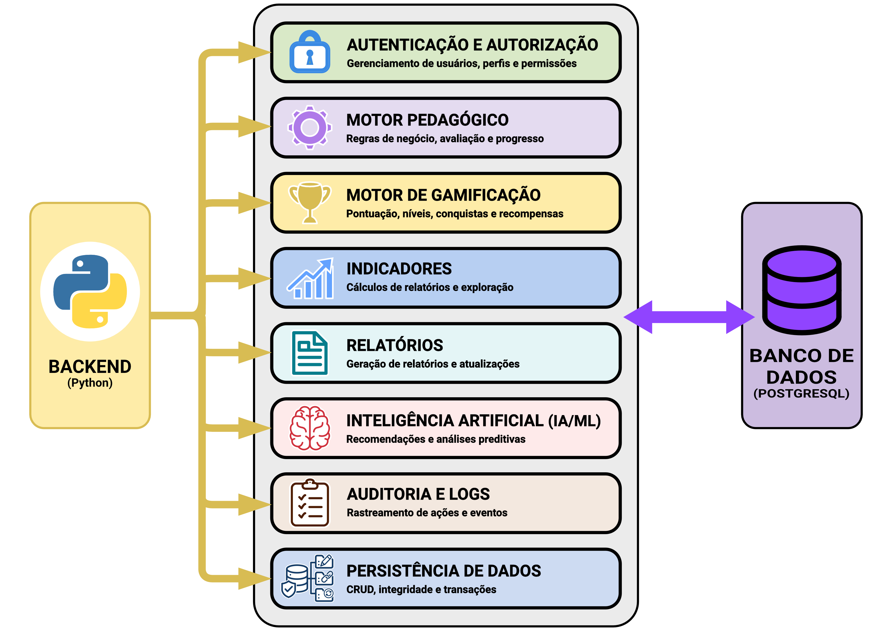
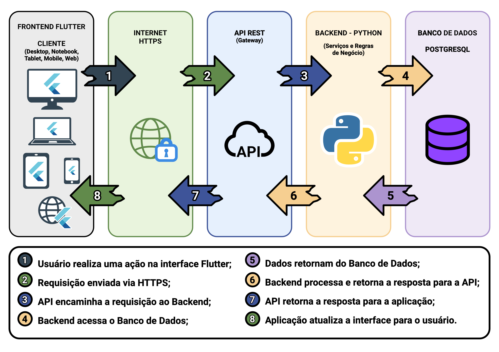
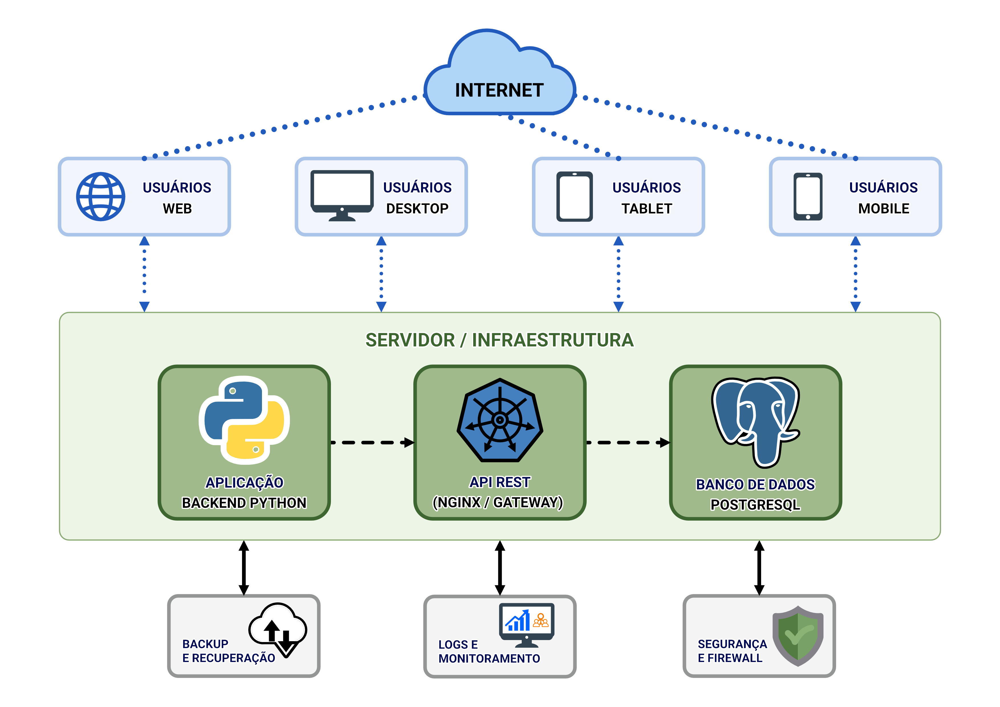

# 09_ARQUITETURA_DE_SOFTWARE.md

# Arquitetura de Software

**GPA – Gamificação Pedagógica de Aprendizagens**  
**Documento:** Arquitetura de Software  
**Versão:** 1.3.3

---

# 1. Introdução

Este documento apresenta a arquitetura de software do GPA, definindo a organização da plataforma, seus componentes, camadas e diretrizes para evolução tecnológica.

---

# 2. Objetivos da Arquitetura

- Modularidade
- Escalabilidade
- Baixo acoplamento
- Alta coesão
- Reutilização de componentes
- Independência tecnológica
- Execução multiplataforma

---

# 3. Visão Geral da Arquitetura

A arquitetura do GPA é organizada em componentes independentes que compartilham um único núcleo de domínio.

<div align="center">



**Figura 1 – Arquitetura da Plataforma GPA**

</div>

A Figura 1 resume os principais componentes da arquitetura. O detalhamento encontra-se nas figuras seguintes.

---

# 4. Princípios Arquiteturais

- Domínio pedagógico como núcleo do sistema.
- Arquitetura modular.
- Evolução incremental.
- Segurança.
- Interoperabilidade.
- Multiplataforma.

---

# 5. Perfis de Usuário

A arquitetura contempla os seguintes perfis:

- Administrador
- Gestor Educacional
- Diretor Escolar
- Coordenador Pedagógico
- Professor
- Responsável
- Estudante

---

# Arquitetura da Plataforma GPA

## 1. Arquitetura Geral do GPA

<div align="center">



**Figura 2 – Arquitetura Geral - GPA**

</div>

```

Apresenta a visão macro da plataforma e seus principais componentes.

---

## 2. Arquitetura em Camadas

```markdown

```

Representa a separação entre Frontend, Aplicação, Serviços, Domínio, Infraestrutura e Persistência.

---

## 3. Arquitetura de Frontend (Flutter)

```markdown

```

Apresenta os módulos da interface, autenticação, atividades, dashboards, gamificação, relatórios e configurações.

---

## 4. Arquitetura de Backend (Python)

```markdown

```

Apresenta os serviços responsáveis pelo motor pedagógico, gamificação, indicadores, relatórios, auditoria e persistência.

---

## 5. Fluxograma de Comunicação entre Componentes

```markdown

```

Representa o fluxo de comunicação entre Cliente, API, Backend e Banco de Dados.

---

## 6. Arquitetura de Implementação (Deployment)

```markdown

```

Apresenta a infraestrutura de implantação da plataforma, incluindo servidores, API, banco de dados, monitoramento, backup e segurança.

---

# 6. Arquitetura Multiplataforma

O GPA compartilha o mesmo núcleo de domínio entre Desktop, Web, Tablet e Smartphone.

---

# 7. Segurança Arquitetural

A arquitetura contempla autenticação, autorização, HTTPS, auditoria, logs e conformidade com a LGPD.

---

# 8. Relação com os Demais Documentos

- 10_MODELO_DE_DOMINIO.md
- 11_MODELO_CONCEITUAL.md
- 16_ARQUITETURA_MULTIPLATAFORMA.md
- 17_FLUXOS_DA_APLICACAO.md

---

# 9. Considerações Finais

A arquitetura do GPA estabelece a base técnica para evolução sustentável da plataforma, alinhando arquitetura pedagógica, software e infraestrutura.