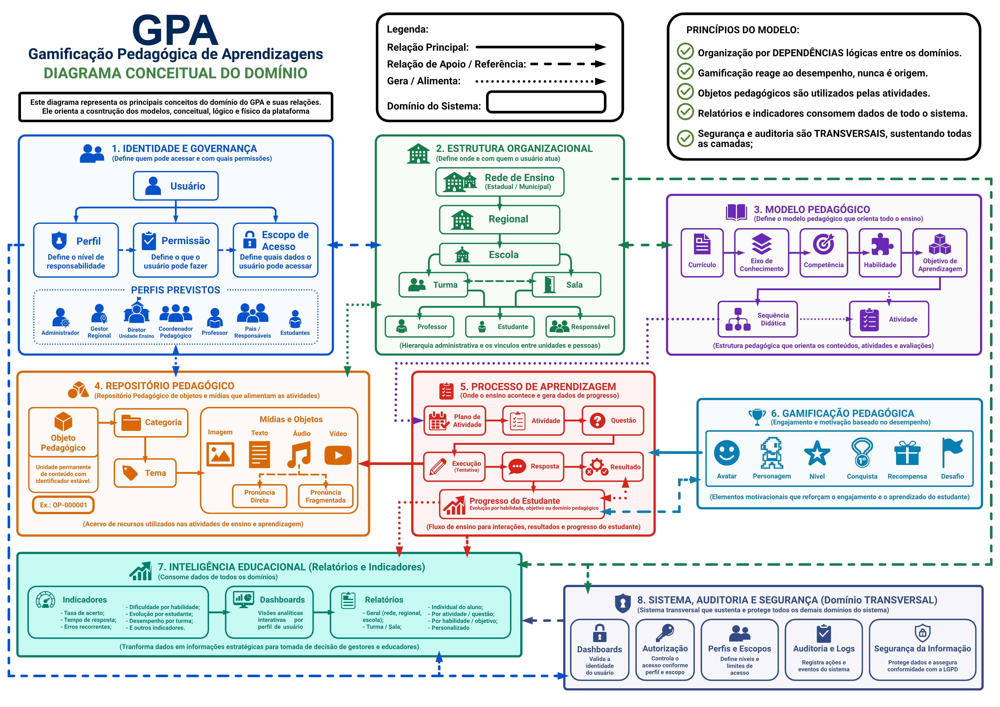

# 10. Mapa Arquitetural do Domínio

# Modelo de Domínio

**GPA – Gamificação Pedagógica de Aprendizagens**  
**Documento:** Mapa Arquitetural do Domínio   
**Versão:** 1.3.3
**Área:** Engenharia
**Documento relacionado:** `09_ARQUITETURA_DE_SOFTWARE.md`

---

## 1. Objetivo

Este documento descreve o **Mapa Arquitetural do Domínio** do GPA, organizado por dependências funcionais entre os domínios do sistema.

O Mapa Arquitetural do Domínio não é um modelo de banco de dados e não representa tabelas, chaves primárias ou comandos SQL. Ele define os conceitos essenciais que devem ser compreendidos pela equipe pedagógica, técnica e de gestão.

Este documento serve como base para os documentos posteriores de modelagem, especialmente:

- `11_MODELO_CONCEITUAL.md`
- `12_MODELO_LOGICO.md`
- `13_MODELO_FISICO.md`
- `14_DIAGRAMA_DE_CLASSES.md`
- `15_DIAGRAMA_DE_CASOS_DE_USO.md`

---

## 2. Mapa Geral

A Figura 1 apresenta uma visão conceitual do domínio do GPA, destacando os principais grupos de conceitos do sistema e suas relações em alto nível.

Este diagrama não representa arquitetura de software, banco de dados ou infraestrutura. Seu objetivo é apresentar o vocabulário central do domínio do projeto.

<div align="center">



**Figura 1 – Diagrama conceitual de domínio do GPA.**

</div>

---

## 3. Organização dos Domínios

``` text
GPA
├── 1. Identidade e Governança
├── 2. Estrutura Organizacional
├── 3. Modelo Pedagógico
├── 4. Repositório Pedagógico
├── 5. Processo de Aprendizagem
├── 6. Gamificação Pedagógica
├── 7. Inteligência Educacional
└── 8. Sistema, Auditoria e Segurança (Transversal)
```

Fluxo principal:

``` text
Identidade e Governança
        ↓
Estrutura Organizacional
        ↓
Modelo Pedagógico
        ↓
Repositório Pedagógico
        ↓
Processo de Aprendizagem
        ↓
Gamificação Pedagógica
        ↓
Inteligência Educacional

Sistema, Auditoria e Segurança
        └── Atua transversalmente sobre todos os domínios
```

## 4. Domínios

### 1. Identidade e Governança

Usuários, Perfis, Permissões e Escopos de Acesso.

### 2. Estrutura Organizacional

Rede de Ensino, Regional, Escola, Turma, Sala, Professor, Estudante e
Responsável.

### 3. Modelo Pedagógico

Currículo, Eixo de Conhecimento, Competência, Habilidade, Objetivo de
Aprendizagem e Sequência Didática.

### 4. Repositório Pedagógico

Objetos Pedagógicos, Categorias, Temas e Mídias reutilizáveis.

### 5. Processo de Aprendizagem

Plano de Atividade → Atividade → Questão → Execução → Resposta →
Resultado → Progresso.

### 6. Gamificação Pedagógica

Avatar, Personagem, Nível, Conquista, Recompensa e Desafio.

### 7. Inteligência Educacional

Indicadores, Dashboards e Relatórios.

### 8. Sistema, Auditoria e Segurança

Autenticação, Autorização, Auditoria, Logs e Segurança da Informação.

## 5. Princípios

-   Organização por dependências funcionais.
-   Objetos pedagógicos são utilizados pelas atividades.
-   Gamificação reage ao desempenho.
-   Inteligência Educacional consome dados de todos os domínios.
-   Segurança é transversal.

## 6. Evolução da Modelagem

``` text
Mapa Arquitetural do Domínio
        ↓
Modelo Conceitual
        ↓
Modelo Lógico
        ↓
Modelo Físico
        ↓
Diagrama de Classes
        ↓
Arquitetura de Software
```
