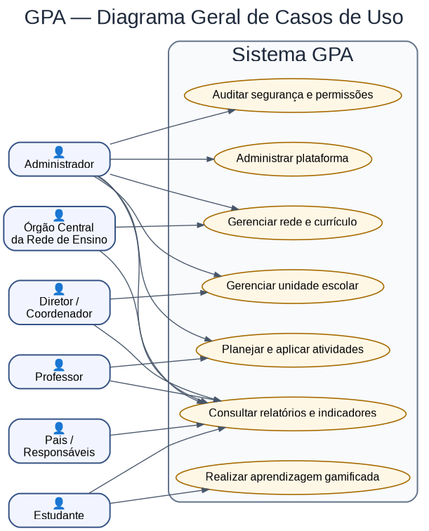
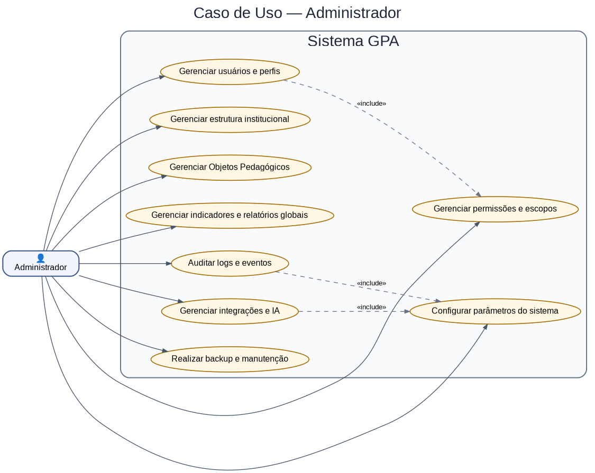
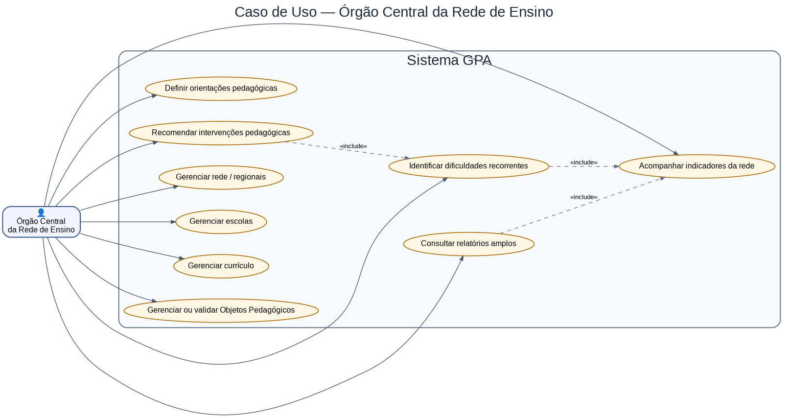
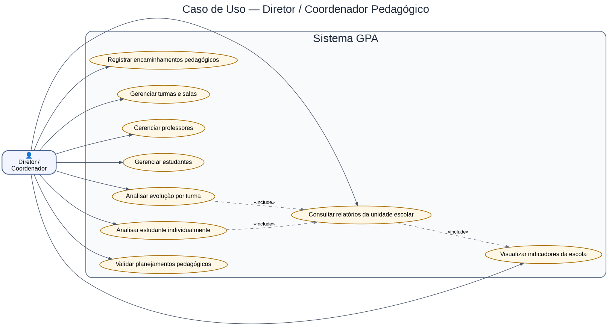
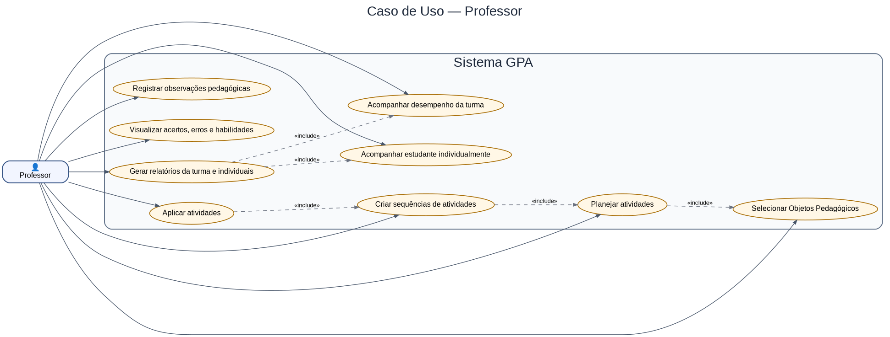
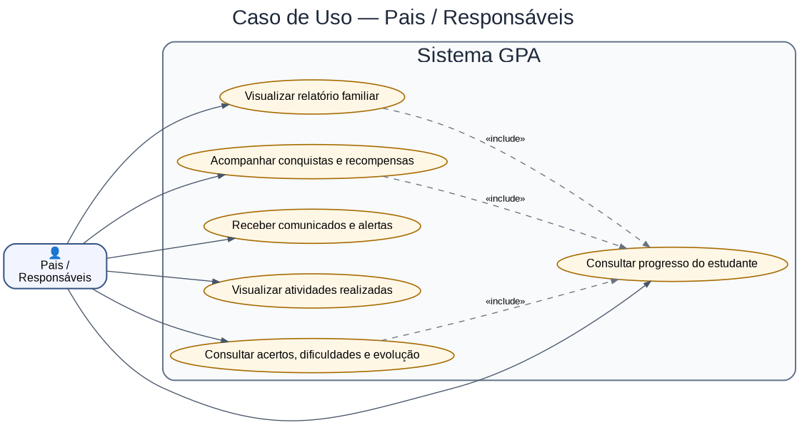
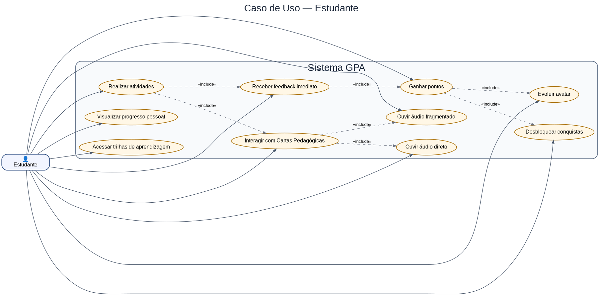

# 15 — Diagrama de Casos de Uso

# Diagrama de Casos de Uso

**GPA – Gamificação Pedagógica de Aprendizagens**  
**Documento:** Diagrama de Casos de Uso   
**Versão:** 1.3.3
**Área:** Engenharia
**Documento relacionado:** `14_DIAGRAMA_DE_CLASSES.md`

## Objetivo

Este documento apresenta os Diagramas de Casos de Uso (UML) do **GPA — Gamificação Pedagógica de Aprendizagens**.

Como o sistema possui diferentes perfis de acesso e permissões, os diagramas foram separados por ator. Essa organização facilita a análise das responsabilidades, dos limites de acesso e das funcionalidades disponíveis para cada perfil.

---

## Atores do Sistema

| Ator | Descrição |
|---|---|
| Administrador | Possui acesso amplo ao sistema e gerencia usuários, permissões, cadastros estruturais, configurações, auditoria e integrações. |
| Órgão Central da Rede de Ensino | Acompanha a rede ou regional, analisa indicadores, orienta ações pedagógicas e gerencia diretrizes curriculares e objetos pedagógicos. |
| Diretor / Coordenador Pedagógico | Acompanha a unidade escolar, suas turmas, professores, estudantes, relatórios e indicadores locais. |
| Professor | Planeja, aplica e acompanha atividades pedagógicas, observando o desempenho da turma e dos estudantes. |
| Pais / Responsáveis | Acompanham exclusivamente o estudante vinculado, seus relatórios, conquistas e evolução. |
| Estudante | Realiza atividades, interage com objetos pedagógicos, recebe feedback e evolui na gamificação. |

---

## 1. Matriz Geral de Permissões

|              Funcionalidade              | Administrador |  Órgão Central da |  Diretor e  | Professor | Pais | Estudante |
|                                          |               |  Rede de Ensino   | Coordenador |           |      |           |
|:----------------------------------------:|:-------------:|:-----------------:|:-----------:|:---------:|:----:|:---------:|
| Gerenciar usuários                       |      ⚙️       |        ❌        |     ❌      |    ❌    |  ❌  |    ❌    |
| Gerenciar perfis e permissões            |      ⚙️       |        ❌        |     ❌      |    ❌    |  ❌  |    ❌    |
| Gerenciar rede / regionais               |      ⚙️       |        ✏️        |     ❌      |    ❌    |  ❌  |    ❌    |
| Gerenciar escolas                        |      ⚙️       |        ✏️        |     ❌      |    ❌    |  ❌  |    ❌    |
| Gerenciar turmas e salas                 |      ⚙️       |        ✏️        |     ✏️      |    ❌    |  ❌  |    ❌    |
| Gerenciar professores                    |      ⚙️       |        ✏️        |     ✏️      |    ❌    |  ❌  |    ❌    |
| Gerenciar estudantes                     |      ⚙️       |        ✏️        |     ✏️      |    ✏️    |  ❌  |    ❌    |
| Gerenciar currículo                      |      ⚙️       |        ✏️        |     👁️      |    👁️    |  ❌  |    ❌    |
| Gerenciar Objetos Pedagógicos            |      ⚙️       |        ✏️        |     👁️      |    ✏️    |  ❌  |    ❌    |
| Planejar atividades                      |      👁️       |        👁️        |     👁️      |    ✏️    |  ❌  |    ❌    |
| Aplicar atividades                       |      👁️       |        👁️        |     👁️      |    ▶️    |  ❌  |    ❌    |
| Realizar atividades                      |      ❌       |        ❌        |     ❌      |    ❌    |  ❌  |    ▶️    |
| Interagir com Cartas Pedagógicas         |      ❌       |        ❌        |     ❌      |    ❌    |  ❌  |    ▶️    |
| Consultar relatórios amplos              |      👁️       |        👁️        |     👁️      |    ❌    |  ❌  |    ❌    |
| Consultar relatórios da turma            |      👁️       |        👁️        |     👁️      |    👁️    |  ❌  |    ❌    |
| Consultar relatório individual           |      👁️       |        👁️        |     👁️      |    👁️    |  👁️  |    👁️    |
| Acompanhar conquistas                    |      👁️       |        👁️        |     👁️      |    👁️    |  👁️  |    👁️    |
| Visualizar dashboards                    |      👁️       |        👁️        |     👁️      |    👁️    |  ❌  |    ❌    |
| Auditar logs                             |      ⚙️       |        👁️        |     ❌      |    ❌    |  ❌  |    ❌    |

---

## Legenda da Matriz de Permissões

| Símbolo | Nível de Permissão | Descrição |
|:-------:|--------------------|-----------|
|   ⚙️   | **Administração**   | Possui controle total sobre a funcionalidade, incluindo criação, alteração, exclusão, configuração e administração do recurso. |
|   ✏️   | **Gerenciamento**   | Pode criar, editar e excluir registros dentro do escopo de atuação definido para seu perfil. |
|   👁️   |    **Consulta**     | Possui acesso somente para visualização das informações, sem permissão para alteração. |
|   ▶️   |    **Execução**     | Pode utilizar a funcionalidade operacional do sistema, executando ações previstas para o seu perfil, sem alterar configurações administrativas. |
|   ❌   |   **Sem acesso**    | Não possui permissão para acessar ou visualizar a funcionalidade. |

### Observações

- As permissões apresentadas nesta matriz representam o **nível máximo de acesso** permitido para cada perfil.
- O acesso efetivo aos dados é controlado também pelo **escopo de atuação** do usuário (Rede, Regional, Escola, Turma, Sala ou Estudante).
- Um mesmo perfil pode possuir diferentes escopos de acesso, sem alteração de suas permissões funcionais.
- O modelo de autorização do GPA combina **Controle de Acesso Baseado em Papéis (RBAC)** com **Controle de Acesso Baseado em Escopo (ABAC)**, garantindo segurança, rastreabilidade e aderência à estrutura organizacional das instituições de ensino.

---

## 2. Visão Geral do Sistema



---

## 3. Administrador

O Administrador possui acesso amplo à plataforma e é responsável pela manutenção estrutural, técnica e operacional do sistema.



### Permissões principais

- Gerenciar usuários e perfis.
- Gerenciar permissões e escopos de acesso.
- Gerenciar rede, regionais, escolas, turmas, salas, professores e estudantes.
- Gerenciar objetos pedagógicos.
- Gerenciar indicadores e relatórios globais.
- Configurar parâmetros do sistema.
- Auditar logs e eventos.
- Gerenciar integrações com IA e serviços externos.

---

## 4. Órgão Central da Rede de Ensino

**Rede Estadual:** Núcleo Pedagógico  
**Rede Municipal:** Secretaria Municipal da Educação

Este perfil atua em nível regional, municipal ou institucional, acompanhando escolas, indicadores e diretrizes pedagógicas.



### Permissões principais

- Gerenciar currículo, competências, habilidades e objetivos.
- Gerenciar ou validar objetos pedagógicos.
- Acompanhar escolas e indicadores da rede.
- Gerar relatórios regionais ou municipais.
- Identificar dificuldades recorrentes.
- Definir orientações pedagógicas.
- Recomendar intervenções pedagógicas.

---

## 5. Diretor / Coordenador Pedagógico

Este perfil atua no escopo da unidade escolar, acompanhando turmas, professores, estudantes e indicadores locais.



### Permissões principais

- Gerenciar turmas e salas da escola.
- Acompanhar professores e estudantes.
- Visualizar indicadores da escola.
- Gerar relatórios da unidade escolar.
- Analisar evolução por turma e por estudante.
- Validar planejamentos e acompanhar ações pedagógicas.
- Registrar encaminhamentos pedagógicos.

---

## 6. Professor

O Professor atua diretamente na execução pedagógica com suas turmas e estudantes.



### Permissões principais

- Planejar atividades.
- Selecionar objetos pedagógicos.
- Criar sequências de atividades.
- Aplicar atividades.
- Acompanhar desempenho da turma.
- Acompanhar estudante individualmente.
- Registrar observações pedagógicas.
- Visualizar acertos, erros, habilidades e evolução.
- Gerar relatórios da turma e relatórios individuais.

---

## 7. Pais / Responsáveis

Os Pais ou Responsáveis possuem acesso restrito ao estudante vinculado.



### Permissões principais

- Consultar progresso do estudante vinculado.
- Visualizar relatórios destinados à família.
- Acompanhar conquistas e recompensas.
- Receber comunicados e alertas.
- Visualizar atividades realizadas.
- Consultar acertos, dificuldades e evolução por habilidade.

---

## 8. Estudante

O Estudante é o usuário central da experiência pedagógica gamificada.



### Permissões principais

- Acessar trilhas de aprendizagem.
- Realizar atividades.
- Interagir com cartas pedagógicas.
- Ouvir áudio direto e áudio fragmentado.
- Receber feedback imediato.
- Ganhar pontos.
- Evoluir avatar.
- Desbloquear conquistas.
- Receber recompensas.
- Visualizar progresso pessoal.

---

## 9. Regras de Escopo

O acesso no GPA é definido pela combinação entre **perfil** e **escopo**.

| Perfil | Escopo principal |
|---|---|
| Administrador | Sistema completo |
| Núcleo Pedagógico / Secretaria | Rede, regional ou conjunto de escolas |
| Diretor / Coordenador | Escola ou unidade escolar |
| Professor | Turmas, salas e estudantes sob sua responsabilidade |
| Pais / Responsáveis | Estudante vinculado |
| Estudante | Próprios dados e atividades |

---

## 10. Organização dos Arquivos de Imagem

```text
docs/
└── assets/
    └── casos_de_uso/
        ├── caso_uso_geral_gpa.png
        ├── caso_uso_administrador.png
        ├── caso_uso_nucleo_pedagogico.png
        ├── caso_uso_diretor.png
        ├── caso_uso_professor.png
        ├── caso_uso_pais.png
        └── caso_uso_estudante.png
```

---

## 11. Observação

Os diagramas de casos de uso representam uma visão funcional de alto nível. Novos casos podem ser adicionados conforme o GPA evoluir, especialmente nas áreas de IA, relatórios avançados, sincronização offline e personalização pedagógica.
