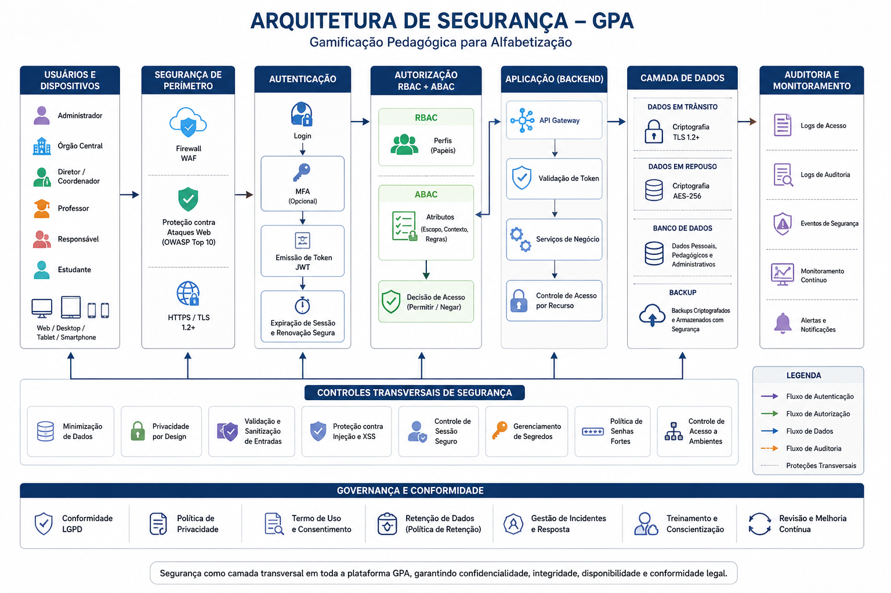

# 18_SEGURANCA_E_PRIVACIDADE.md

# Segurança e Privacidade

**GPA – Gamificação Pedagógica de Aprendizagens**  
**Documento:** Segurança e Privacidade   
**Versão:** 1.3.3
**Área:** Engenharia
**Documento relacionado:** `09_ARQUITETURA_DE_SOFTWARE.md`
                         - `14_DIAGRAMA_DE_CLASSES.md`
                         - `16_ARQUITETURA_MULTIPLATAFORMA.md`
                         - `17_FLUXOS_DA_APLICACAO.md`

---

# 1. Objetivo

Este documento estabelece a arquitetura de Segurança e Privacidade do GPA, definindo princípios, mecanismos de autenticação, autorização, proteção de dados, auditoria e conformidade com a LGPD.

---

# 2. Princípios de Segurança

- Security by Design
- Privacy by Design
- Menor Privilégio
- Defesa em Profundidade
- Rastreabilidade
- Proteção de Dados Pessoais
- Transparência
- Auditoria Permanente

---

# 3. Arquitetura de Segurança

<div align="center">



**Figura 1 – Arquitetura de Segurança do GPA**

</div>

A arquitetura integra autenticação, autorização, API, backend, banco de dados, auditoria e monitoramento.

---

# 4. Controle de Acesso

O GPA utiliza dois níveis de controle:

- **RBAC (Role Based Access Control)** – permissões por perfil.
- **ABAC (Attribute Based Access Control)** – restrições por escopo.

Modelo:

```text
Perfil + Escopo = Permissão efetiva
```

---

# 5. Perfis

- Administrador
- Órgão Central da Rede de Ensino
- Diretor / Coordenador
- Professor
- Pais / Responsáveis
- Estudante

---

# 6. Autenticação

Requisitos:

- Hash seguro de senhas;
- Sessões autenticadas por token (JWT ou equivalente);
- Expiração automática de sessão;
- Recuperação segura de senha;
- Limitação de tentativas de acesso;
- Comunicação exclusivamente via HTTPS.

---

# 7. Autorização

Cada requisição deverá validar:

1. O usuário possui permissão?
2. O escopo permite acesso ao recurso solicitado?

A validação deve ocorrer no backend.

---

# 8. Proteção de Dados

Dados protegidos:

- estudantes;
- responsáveis;
- progresso pedagógico;
- respostas;
- relatórios;
- objetos pedagógicos privados;
- logs;
- auditorias.

Medidas:

- criptografia em trânsito (HTTPS);
- proteção de credenciais;
- controle de acesso;
- minimização de dados.

---

# 9. LGPD

O GPA observa os princípios da LGPD:

- finalidade;
- adequação;
- necessidade;
- transparência;
- segurança;
- prevenção;
- responsabilização.

Os dados deverão ser utilizados exclusivamente para fins educacionais.

---

# 10. Logs e Auditoria

Registrar:

- login/logout;
- tentativas inválidas;
- alterações cadastrais;
- alterações de permissões;
- alterações em estudantes;
- alterações em Objetos Pedagógicos;
- emissão de relatórios;
- ações administrativas.

Cada registro deve conter usuário, data/hora, operação, recurso afetado e resultado.

---

# 11. Backup e Recuperação

Recomenda-se:

- backups automáticos;
- testes periódicos de restauração;
- retenção conforme política institucional;
- armazenamento seguro.

---

# 12. Boas Práticas

- HTTPS obrigatório;
- validação de entradas;
- proteção contra exposição de identificadores;
- segregação de ambientes;
- monitoramento contínuo;
- revisão periódica de permissões.

---

# 13. Relação com os Demais Documentos

Este documento complementa:

- 09_ARQUITETURA_DE_SOFTWARE.md
- 14_DIAGRAMA_DE_CLASSES.md
- 16_ARQUITETURA_MULTIPLATAFORMA.md
- 17_FLUXOS_DA_APLICACAO.md

---

# 14. Considerações Finais

A segurança e a privacidade são requisitos estruturais do GPA e devem orientar todas as decisões de arquitetura, desenvolvimento, integração, armazenamento e uso dos dados da plataforma, garantindo conformidade legal, proteção das informações e suporte seguro ao processo pedagógico.

